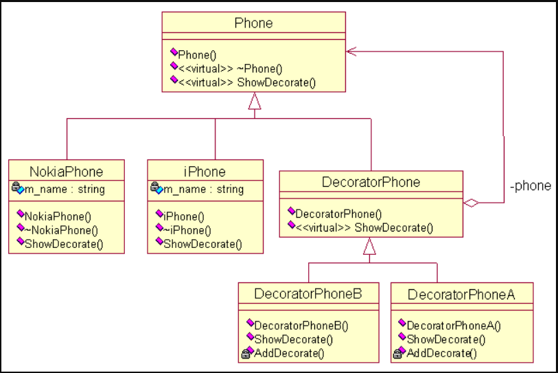

# 继承规则


#  模板模式
在软件构建过程中，对于某一项任务，他常常有稳定的整体操作结构，但各个子步骤却有很多改变的需求，或者由于固有的原因（比如框架与应用之间的关系）而无法和任务的整体结构同时实现。如何在确定稳定操作结构的前提下，来灵活应对各个子步骤的变化？

- 结构化软件设计流程：


- 面向对象软件设计流程：


```cpp
#include <vector>
#include <iostream>
#include <string>

using namespace std;

class AbstractClass
{
private:
public:
    void TemplateMethod()
    {
        PrimitiveOperation1();
        cout << "Fixed step." << endl;
        PrimitiveOperation2();
    }

protected:
    virtual void PrimitiveOperation1()
    {
        cout << "Default Operation1" << endl;
    }
    virtual void PrimitiveOperation2()
    {
        cout << "Default Operation2" << endl;
    }
};

class ConcreteClassA : public AbstractClass
{
protected:
    virtual void PrimitiveOperation1()
    {
        cout << "ConcreteA Operation1" << endl;
    }
    virtual void PrimitiveOperation2()
    {
        cout << "ConcreteA Operation2" << endl;
    }
};

class ConcreteClassB : public AbstractClass
{
protected:
    virtual void PrimitiveOperation1()
    {
        cout << "ConcreteB Operation1" << endl;
    }
    virtual void PrimitiveOperation2()
    {
        cout << "ConcreteB Operation2" << endl;
    }
};

int main(void)
{
    AbstractClass* pAbstractA = new ConcreteClassA;
    pAbstractA->TemplateMethod();

    AbstractClass* pAbstractB = new ConcreteClassB;
    pAbstractB->TemplateMethod();

    if(pAbstractA)
        delete pAbstractA;
    if(pAbstractB)
        delete pAbstractB;
    return 0;
}
```


# [观察者模式](https://www.cnblogs.com/carsonzhu/p/5770253.html)
定义了一种一对多的依赖关系，让多个观察者对象同时监听某一主题对象，在主题对象的状态发生变化时,会通知所有的观察者。

观察者角色如下：
-  抽象主题（Subject）角色：抽象主题角色提供维护一个观察者对象集合的操作方法，对集合的增加、删除等。
-  具体主题（ConcreteSubject）角色：将有关状态存入具体的观察者对象；在具体主题的内部状态改变时，给所有登记过的观察者发通知。具体主题角色负责实现抽象主题中的方法。
- 抽象观察者（Observer）角色：为具体观察者提供一个更新接口。
- 具体观察者（ConcreteObserver）角色：存储与主题相关的自洽状态，实现抽象观察者提供的更新接口。


> 在教室里老师还没有来，同学都在干着各的事情，小张正在打游戏，小李正在抄作业.....,  现在同学们要求班长当卧底，监视老师，当老师来了通知大家一声。然后打游戏的马上停止，抄作业的也停止。这里班长相当于是一个通知者， 小张、小李，以及其他同学显然是监听者，他们监听了班长那的消息，一旦老师来了马上采取相关的行动。

```cpp
#include <vector>
#include <iostream>
#include <string>
#include <list>

using namespace std;
class ITeacherListenner;
class ZhangSan;
class LiSi;
class INotifier;
class MonitorNotifier;

// 抽象观察者，为具体观察者提供一个更新借口
class ITeacherListenner
{
public:
    virtual void onTecherComming(int value) = 0;
};

// 抽象主题
class INotifier
{
    virtual void registerListenner(ITeacherListenner *l) = 0;
    virtual void removeListenner(ITeacherListenner *l)   = 0;
    virtual void notify()                                = 0;
};

// 具体主题
class MonitorNotifier : public INotifier
{
private:
    list<ITeacherListenner *> listenners;
    int                       mValue;

public:
    void registerListenner(ITeacherListenner *l)
    {
        listenners.push_back(l);
    }
    void removeListenner(ITeacherListenner *l)
    {
        list<ITeacherListenner *>::iterator it;
        for(it = listenners.begin(); it != listenners.end(); it++)
        {
            if(*it == l)
            {
                listenners.remove(l);
                break;
            }
        }
    }

    void notify()
    {
        list<ITeacherListenner *>::iterator it;

        for(it = listenners.begin(); it != listenners.end(); it++)
        {
            (*it)->onTecherComming(mValue);
        }
    }

    void setValue(int value)
    {
        mValue = value;
        notify();
    }
};

// 具体观察者
class ZhangSan : public ITeacherListenner
{
public:
    void stopCopyWork(int value)
    {
        cout << "zhangsan stop copy work + " << value << endl;
    }
    void onTecherComming(int value)
    {
        stopCopyWork(value);
    }
};

// 具体观察者
class LiSi : public ITeacherListenner
{
public:
    void stopCopyWork(int value)
    {
        cout << "lisi stop copy work + " << value << endl;
    }
    void onTecherComming(int value)
    {
        stopCopyWork(value);
    }
};

int main(void)
{
    cout << "Hello world 1---------------------" << endl;
    MonitorNotifier monitor;
    ZhangSan        zs;
    LiSi            ls;
    monitor.registerListenner(&zs);
    monitor.registerListenner(&ls);
    monitor.setValue(1);

    cout << "Hello world 2---------------------" << endl;
    monitor.removeListenner(&ls);
    monitor.setValue(2);
    return 0;
}
```

# [装饰模式(Decorator)](https://blog.csdn.net/wuzhekai1985/article/details/6672614)
动态的将职责附加到对象上，若要扩展功能，装饰者提供了比继承更具弹性的代替方案。它使功能具有动态性。比如有一个手机，允许你为手机添加特性，比如增加挂件、屏幕贴膜等。一种灵活的设计方式是，将手机嵌入到另一对象中，由这个对象完成特性的添加，我们称这个嵌入的对象为装饰。这个装饰与它所装饰的组件接口一致，因此它对使用该组件的客户透明。


```cpp
#include <iostream>

using namespace std;

// 坦克抽象类(component)
class Tank
{
public:
    virtual void shot()
    {
        cout << "向我开炮!" << endl;
    }
};

// Concrete Component
// 具体的坦克型号
class T50 : public Tank
{
    virtual void shot()
    {
        cout << "T50开炮!" << endl;
    }
};

class Decorator : public Tank
{
protected:
    Tank* tank;

public:
    void decorator(Tank* _tank)  // 没有在构造函数里完成初始化，并不是推荐的写法
    {
        this->tank = _tank;
    }
    virtual void shot()
    {
        tank->shot();
    }
};

class DecoratorBigShot : public Decorator
{
public:
    virtual void shot()
    {
        cout << "大火力准备完毕" << endl;
        tank->shot();
    }
};

class DecoratorSilentShot : public Decorator
{
public:
    virtual void shot()
    {
        cout << "消音完毕" << endl;
        tank->shot();
    }
};

int main(void)
{
    Tank* ptank = new T50();  // 基类指针指向派生类对象
                              //    Decorator* pDecorator = new Decorator();
                              //    pDecorator->decorator(ptank);  // 装饰器中添加要装饰的对象

    DecoratorBigShot* pBig = new DecoratorBigShot();  // 每个装饰器实现一个功能
    pBig->decorator(ptank);

    DecoratorSilentShot* pBigSilent = new DecoratorSilentShot();
    pBigSilent->decorator(pBig);
    pBigSilent->shot();

    return 0;
}
```

```cpp
#include <iostream>

using namespace std;

// 公共抽象类 Component
class Phone
{
public:
    Phone(){};
    virtual ~Phone(){};
    virtual void ShowDecorate(){};
};

// 具体手机类
class iPhone : public Phone
{
private:
    string m_name;

public:
    iPhone(string name)
        : m_name(name)
    {
    }
    ~iPhone()
    {
    }
    void ShowDecorate()
    {
        cout << m_name << "的装饰" << endl;
    }
};

// 具体手机类
class NokiaPhone : public Phone
{
private:
    string m_name;

public:
    NokiaPhone(string name)
        : m_name(name)
    {
    }
    ~NokiaPhone()
    {
    }
    void ShowDecorate()
    {
        cout << m_name << "的装饰" << endl;
    }
};

// 抽象装饰类，继承Component
class DecoratorPhone : public Phone
{
private:
    Phone *m_phone;  // 要装饰的手机

public:
    DecoratorPhone(Phone *phone)
        : m_phone(phone)
    {
    }
    virtual void ShowDecorate()
    {
        m_phone->ShowDecorate();
    }
};

class DecoratorPhoneA : public DecoratorPhone
{
public:
    DecoratorPhoneA(Phone *phone)
        : DecoratorPhone(phone)
    {
    }
    void ShowDecorate()
    {
        DecoratorPhone::ShowDecorate();
        AddDecorate();
    }

private:
    void AddDecorate()
    {
        cout << "增加挂件" << endl;
    }
};

class DecoratorPhoneB : public DecoratorPhone
{
public:
    DecoratorPhoneB(Phone *phone)
        : DecoratorPhone(phone)
    {
    }
    void ShowDecorate()
    {
        DecoratorPhone::ShowDecorate();
        AddDecorate();
    }

private:
    void AddDecorate()
    {
        cout << "屏幕贴膜" << endl;
    }
};

int main(int argc, char *argv[])
{
    Phone *iphone = new NokiaPhone("6300");
    Phone *dpa    = new DecoratorPhoneA(iphone);  // 装饰， 增加挂件
    Phone *dpb    = new DecoratorPhoneB(dpa);     // 装饰，屏幕贴膜
    dpb->ShowDecorate();

    delete dpa;
    delete dpb;
    delete iphone;

    return 0;
}
```

# 策略模式
是指定义一系列的算法，把它们一个个封装起来，并且使它们可相互替换。

如我们有很多排序算法，但是在不通的环境中，需要使用不同算法，那就可以定义一个抽象类，提供统一的接口，然后在各个排序算法继承抽象类，并实现该子类的排序算法 ，再定义一个项目类，通过构造函数传入不同算法类的对象或是模板实例化来表示在不同的项目中用使用不同的算法
```cpp
#include <iostream>

using namespace std;

class Sort
{
public:
    virtual void userSort() = 0;
    virtual ~Sort(){};
};

class BubbleSort : public Sort
{
public:
    virtual void userSort() override
    {
        cout << "BubbleSort::userSort()" << endl;
    }
};

class SelectSort : public Sort
{
public:
    virtual void userSort() override
    {
        cout << "SelectSort::userSort()" << endl;
    }
};

class InsertSort : public Sort
{
public:
    virtual void userSort() override
    {
        cout << "InsertSort::userSort()" << endl;
    }
};

class QuickSort : public Sort  //快速排序算法类
{
public:
    virtual void userSort()
    {
        cout << "QuickSort::userSort()" << endl;
    }
};

class Project  //项目类，来根据不同的对象替换不同的算法
{
private:
    Sort *m_sort;

public:
    Project()
    {
    }

    Project(Sort *sort)
        : m_sort(sort)
    {
    }

    void replaceSort()
    {
        m_sort->userSort();
    }
    ~Project()
    {
        if(NULL != m_sort)
            delete m_sort;
    }
};

int main(void)
{
    Sort *  sort = new BubbleSort();
    Project pro(sort);
    pro.replaceSort();

    return 0;
}
```